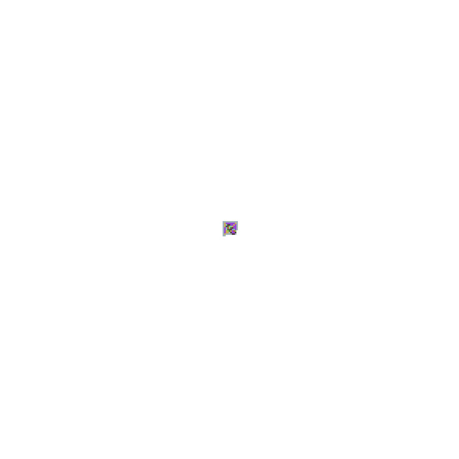
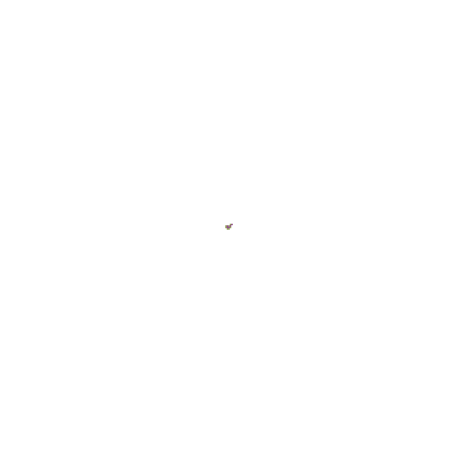

# go-ant

go-ant is a tool to play with Langton Ant representations.

[WEB ASSEMBLY LIVE DEMO](https://metalblueberry.github.io/go-ant/)




## Binaries

### cmd/go-ant

Pixel based app to interactively play with the ant. It can be really fast because performs the calculation in a separate thread. The drawback is that the screen is drawn based on a pre-generated image. This requires a lot of memory and takes time. Overall I prefer the go-ant-ebiten version.

How to run it..

```bash
go-ant -speed 1000 -steps RLLLLRRRLLL
```

### cmd/go-ant-gif

Easily generate gifs. It is really handy to publish it to a webpage. All the gifs that you see around are generated with this tool.

### cmd/go-ant-ebiten

Similar to Pixel version, is an app to interactively play with the ant. The main difference is that this version can be run in a browser with web assembly. The [LIVE DEMO](https://metalblueberry.github.io/go-ant/) page. Another cool advantage is that the draw of the canvas is not based on an intermediate image. this allows to draw really big areas without any problem.

## Cool Patterns

The cmd/explorer is a small binary that will generate all the possible combinations with 12 characters in a board for 1000 for the first 1M iterations. Then you can easily browse the generated images so find cool patterns.

I've found some interesting patterns myself for future reference. The labels doesn't mean anything special, is just a subjective classification.

```txt
LRRLRLLLLLL # Chaotic, pattern, fractal
LLRRRLRLR # Chaotic, spikes
RLLLLLLRRRRL # Chaotic, spikes, fill

LRLLRRRRR # Fill, triangles
LLRLLLRRRRRR # Fill, Triangles, uniform
LRLRLLLLLLLR # Fill, Triangles, Fractal

LRRLLLLLLLR # Fill, not uniform, travel
LRRRLLLRLRLL # Fill, uniform, travel
LRRRLLLRLRR # Fill, uniform, travel

LRRRRLLLRRR # Fill, uniform, symmetric, travel
RLLLLRRRLLL

LRRRRLLLRRRL # Fill, uniform, travel
LRRRRLLR # Fill, uniform, travel, chaotic
LRRRRRRLLR # Fill, uniform, travel, chaotic

LRRLRRLLLLLR # Fill, not uniform, end chaotic
LLRLRRLLRRRL # Fill, uniform, semi chaotic

LRRLLRLLLLLL # Fill, uniform, Fractal


LLRRLRLRLLL # Slow chainsaw grow, end stable

LLRLRLLLLRR # Fill, not uniform, end stable


LLLLLLRRLRLL # highway, Triangle
LLRLRLLLLRLR # highway, Triangle
LLRRRLRRRLLL # highway, Triangle
LLRLRLL # highway, Triangle

LLLLRLLLRRLR # highway, Linear
LLRLRLLRRLL # highway, Linear
LLRLRRLLLLRR # highway, Linear
LLRRLLLRLRRR # highway, Linear, The tree!

LRLLRLRLRLLL # highway, Linear, chaotic

LLRLRRLLLLL # highway, semi-fill
LLRLRRLLLLLL # highway, semi-fill

LLLRLLRRLLLL # highway, fill
LLRRRLRRRRR # highway, fill, triangles
LRLLLRRLRRLR # highway, fill, cracked
LRLLLRRLLLL # highway, fill, perfect

LLLRRRRRRLLL # Symmetric, highlight
LLRRRRLL # Symmetric, highlight
```


## Resources

- https://www.youtube.com/watch?v=w7ESrgpQH4k&ab_channel=Softology